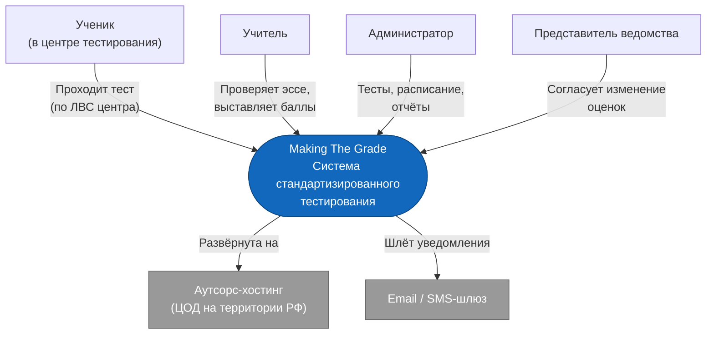
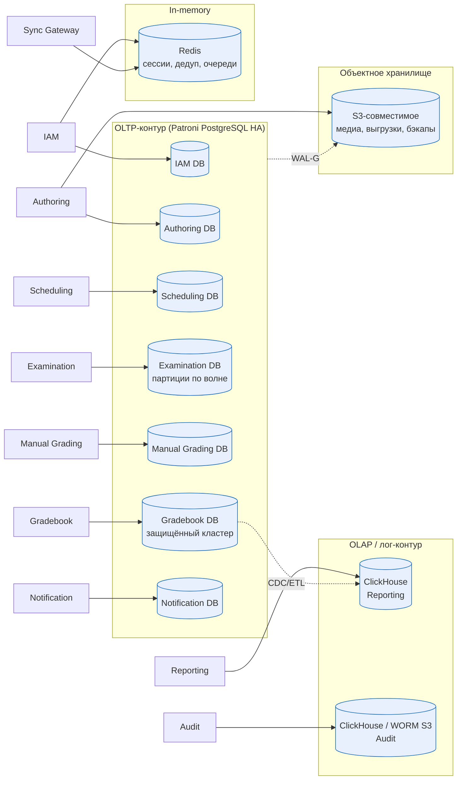
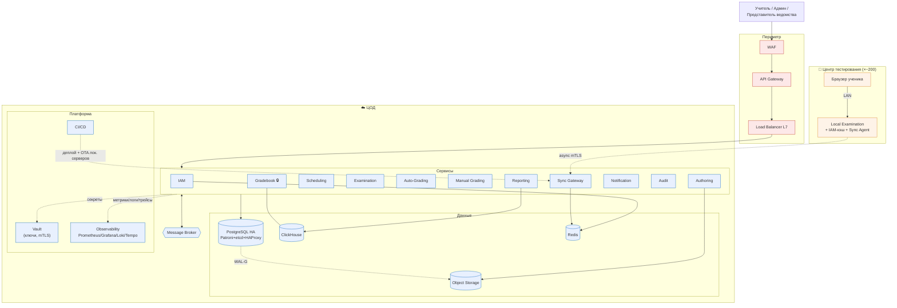

# Домашнее задание №2 - High Level Design

Система: «Making The Grade» - платформа стандартизированного тестирования в государственных школах субъекта РФ (продолжение [HW1](../HW1/HW1%20Report.md)).

## Содержание
- [Вводные из HW1](#вводные-из-hw1)
- [Part 1. Декомпозиция на сервисы](#part-1-декомпозиция-на-сервисы)
  - [Метод](#метод)
  - [Бизнес-домены (bounded contexts)](#бизнес-домены-bounded-contexts)
  - [Перечень сервисов](#перечень-сервисов)
  - [Способы взаимодействия](#способы-взаимодействия)
  - [HLD: контекстная диаграмма (C4 L1)](#hld-контекстная-диаграмма-c4-l1)
  - [HLD: контейнерная диаграмма (C4 L2)](#hld-контейнерная-диаграмма-c4-l2)
- [Part 2. Базы данных](#part-2-базы-данных)
  - [Алгоритм выбора](#алгоритм-выбора)
  - [Выбор БД по сервисам](#выбор-бд-по-сервисам)
  - [Репликация](#репликация)
  - [Шардирование](#шардирование)
  - [Схема с уровнем данных](#схема-с-уровнем-данных)
- [Part 3. Дополнительные компоненты](#part-3-дополнительные-компоненты)
  - [Обязательные (MUST)](#обязательные-must)
  - [Рекомендуемые (SHOULD)](#рекомендуемые-should)
  - [Финальная HLD-схема](#финальная-hld-схема)
- [Итоговые решения](#итоговые-решения)

## Вводные из HW1
Ключевые ограничения, которые определяют архитектуру (из HW1):
- **Двухуровневая топология**: локальный сервер в каждом центре тестирования + центральный ЦОД на аутсорс-хостинге. Ученики работают только с локальной сетью, ЦОД может быть временно недоступен.
- **Нестабильный интернет** в удалённых школах - обязателен офлайн-режим с отложенной синхронизацией.
- **Выраженная сезонность**: пик в дни волн тестирования (worst case ~1 430 RPS на ЦОД), почти простой между волнами (~30 RPS).
- **B2G / ФЗ-152 / ФСТЭК**: повышенные требования к безопасности, аудиту, хранению ПДн на территории РФ, импортозамещение.
- **Тройное согласование** изменений итоговых оценок представителями трёх ведомств.
- **Бюджет подтверждается ежегодно** - предпочтение модульности и pay-as-you-go.

Эти ограничения - причина, по которой ниже часть сервисов вынесена на локальный сервер, а взаимодействие ЦОД ↔ центр сделано асинхронным (store-and-forward).

---

## Part 1. Декомпозиция на сервисы

### Метод
Декомпозиция выполнена по DDD: от модулей HW1 ([Scope Refinement](../HW1/HW1%20Report.md#scope-refinement)) через выделение бизнес-доменов (bounded contexts) к сервисам. Границы сервисов проведены по:
1. **Языку и ответственности домена** - у каждого сервиса свой словарь сущностей (Question/Test, Session/Answer, Grade, Report).
2. **Различию в требованиях к данным и нагрузке** - OLTP-приём ответов и OLAP-отчётность разведены, потому что у них противоположные паттерны (запись пиками vs тяжёлое чтение).
3. **Зонам безопасности** - хранилище итоговых оценок и workflow согласования ведомств изолированы как наиболее защищённый контур (требование тройного согласования).
4. **Границе офлайн/онлайн** - то, что должно работать без связи с ЦОД, вынесено на локальный сервер.

Применён лёгкий Event Storming: ключевые доменные события (`СессияНачата`, `ОтветСохранён`, `ТестЗавершён`, `РаботаОценена`, `ОценкаИзменена`) стали границами между сервисами и основой для асинхронных интеграций.

### Бизнес-домены (bounded contexts)
| Домен | Модуль HW1 | Зона |
|-------|-----------|------|
| Identity & Access | Аутентификация и авторизация | ЦОД + кэш на локальном сервере |
| Test Authoring & Catalog | Администрирование (банк вопросов, сборка тестов, шкалы) | ЦОД |
| Scheduling & Centers | Администрирование (центры, расписание, назначения) | ЦОД |
| Examination (прохождение) | Тестирование | Локальный сервер + ЦОД |
| Auto-Grading | Автоматическая проверка | ЦОД |
| Manual Grading | Ручная проверка | ЦОД |
| Gradebook & Grade-Change | Администрирование (оценки + согласование 3 ведомств) | ЦОД (защищённый контур) |
| Reporting & Analytics | Отчётность | ЦОД |
| Notification | сквозной | ЦОД |
| Audit | сквозной (НФТ безопасности) | ЦОД |
| Sync (шлюз синхронизации) | инфраструктура two-tier | ЦОД ↔ локальные серверы |

### Перечень сервисов
| Сервис | Ответственность | Акторы / источники | Обоснование выделения |
|--------|-----------------|--------------------|-----------------------|
| **IAM Service** | Аутентификация (логин/пароль, 2FA для персонала), авторизация по 4 ролям, выдача токенов, mTLS-доверие к локальным серверам | Все | Сквозная функция, единая точка управления доступом; нельзя размазывать по сервисам |
| **Authoring Service** | Банк вопросов, сборка тестов, критерии оценивания эссе, шкалы перевода баллов | Администратор | Отдельный язык домена (Question/Test/Scale), низкая нагрузка, редкие изменения - своя БД и свой темп релизов |
| **Scheduling Service** | Центры тестирования, локальные серверы (реестр), расписание, назначение тестов учебным группам | Администратор | Управляет «где и когда»; данные нужны и ЦОД, и предзагрузке на локальные серверы |
| **Examination Service** | Жизненный цикл сессии тестирования: старт, автосейв ответов, таймер, завершение. Тонкий двойник работает на локальном сервере | Ученик | Самый нагруженный путь (запись пиками), требует офлайн-работы - вынесен на локальный сервер |
| **Auto-Grading Service** | Автооценка вопросов с множественным выбором, запись первичных баллов | - (триггерится событием) | Stateless-вычисление, масштабируется отдельно под пик, не должно блокировать приём ответов |
| **Manual Grading Service** | Очередь работ, распределение между учителями, блокировка работы, выставление баллов по критериям, прогресс/дедлайны | Учитель | Свой workflow и SLA проверки; нагрузка фоновая, отделена от приёма ответов |
| **Gradebook Service** | Хранилище первичных/вторичных баллов и итоговых оценок, расчёт по шкале, workflow запросов на изменение оценки с согласованием 3 ведомств | Учитель, Администратор, Представитель ведомства | Наиболее защищённый контур (целостность оценок, ФЗ-152, тройное согласование) - строгая изоляция |
| **Reporting Service** | Отчёты и дашборды по ученику/учителю/школе/субъекту, экспорт PDF/Excel, фильтры | Администратор | OLAP-нагрузка (тяжёлое чтение, агрегаты) противоположна OLTP - отдельный сервис и отдельное хранилище |
| **Notification Service** | Уведомления: дедлайны проверки, эскалации согласований, результаты, статус синхронизации | Учитель, Администратор, Представитель ведомства | Сквозная асинхронная функция, изолирует доставку (email/SMS/in-app) от бизнес-логики |
| **Audit Service** | Неизменяемый аудит-лог всех значимых действий (вход, сдача, оценивание, изменение оценок) с актором/временем/IP/источником | - (приёмник событий) | Регуляторное требование, append-only, отдельный жизненный цикл и хранение |
| **Sync Gateway** | Приём пакетов синхронизации от локальных серверов: mTLS, проверка контрольных сумм/подписи, идемпотентность, маршрутизация в Examination/Audit, отдача предзагрузки тестов | Локальные серверы | Узкий доверенный вход для two-tier, изолирует приём недоверенного офлайн-трафика |
| **Local Server (агент центра)** | Локальный двойник Examination + кэш IAM + Sync Agent (store-and-forward). Работает автономно ≥12 ч | Ученик (через браузер по ЛВС) | Реализует офлайн-режим и снимает основную нагрузку записи с ЦОД |

> Намеренно НЕ выделены в отдельные сервисы: расчёт вторичных баллов (часть Gradebook, тесно связан с оценками) и реестр пользователей (часть IAM). Это снижает число интеграций без потери связности.

### Способы взаимодействия
Принцип выбора: **синхронно** - там, где вызывающему нужен немедленный ответ для продолжения сценария (чтение/проверка прав, открытие работы). **Асинхронно** (через брокер сообщений) - там, где важны развязка во времени, устойчивость к недоступности получателя и сглаживание пиков (приём ответов, оценивание, отчётность, аудит, уведомления). Граница ЦОД ↔ центр - всегда асинхронная (store-and-forward), потому что связь может пропадать.

| # | Взаимодействие | Тип | Протокол | Обоснование |
|---|----------------|-----|----------|-------------|
| I-1 | Браузер ученика → Local Server | sync | HTTPS (REST) по ЛВС | Интерактивное прохождение теста, нужен мгновенный отклик (P95 ≤ 200 мс из HW1) |
| I-2 | Local Server ↔ Sync Gateway | **async** | mTLS, batched HTTPS / очередь | Главная развязка: центр работает офлайн, пакеты копятся и досылаются при связи. Идемпотентность по версии ответа |
| I-3 | Любой сервис → IAM (валидация токена/прав) | sync | gRPC/REST | Нужен немедленный вердикт доступа. На локальном сервере - кэш для офлайн-входа |
| I-4 | Sync Gateway → Examination | sync (запись) + событие | gRPC + брокер | Сохранение принятых ответов и публикация `ОтветПринят`/`ТестЗавершён` |
| I-5 | Examination → Auto-Grading | **async** | брокер (топик `test.completed`) | Автопроверка не должна блокировать приём; масштабируется под пик независимо |
| I-6 | Auto-Grading → Gradebook | **async** | брокер (`grade.primary`) | Запись первичных баллов; развязка от вычисления |
| I-7 | Examination → Manual Grading | **async** | брокер (`answers.manual`) | Наполнение очереди работ для учителей, фоновый темп |
| I-8 | Manual Grading → Gradebook | sync (запись балла) + событие `work.graded` | gRPC + брокер | Балл фиксируется транзакционно; событие триггерит расчёт итога |
| I-9 | Gradebook → Reporting | **async** (CDC/события) | брокер + ETL | Перенос итоговых данных в OLAP без нагрузки на оперативную БД |
| I-10 | Gradebook ↔ Notification | **async** | брокер (`grade.change.*`) | Уведомления о статусах согласования, эскалациях |
| I-11 | Все сервисы → Audit | **async** | брокер (топик `audit`) | Аудит не должен влиять на латентность бизнес-операций; гарантированная доставка |
| I-12 | Scheduling/Authoring → Sync Gateway → Local Server | **async** (push) | брокер + предзагрузка по mTLS | Предзагрузка тестов и расписаний в центры за 24 ч до волны |
| I-13 | Представитель ведомства → Gradebook (одобрение) | sync | HTTPS (REST) | Интерактивное действие в веб-интерфейсе согласования |

---

### HLD: контекстная диаграмма (C4 L1)



### HLD: контейнерная диаграмма (C4 L2)
Сервисы и их интеграции (sync - сплошная линия, async через брокер - пунктир).

```mermaid
flowchart TB
    subgraph Center["🏫 Центр тестирования (×~200)"]
        Browser["Браузер ученика"]
        subgraph LocalSrv["Локальный сервер (Docker, автономен ≥12 ч)"]
            LocalExam["Local Examination<br/>(прохождение, автосейв, таймер)"]
            LocalAuth["IAM-кэш<br/>(офлайн-вход)"]
            SyncAgent["Sync Agent<br/>(store-and-forward)"]
        end
        Browser -->|HTTPS LAN| LocalExam
        LocalExam --> LocalAuth
        LocalExam --> SyncAgent
    end

    subgraph DC["☁️ ЦОД (аутсорс-хостинг)"]
        SyncGW["Sync Gateway<br/>(mTLS, checksum, идемпотентность)"]
        IAM["IAM Service"]
        Authoring["Authoring Service"]
        Scheduling["Scheduling Service"]
        Exam["Examination Service"]
        AutoGrade["Auto-Grading Service"]
        ManualGrade["Manual Grading Service"]
        Gradebook["Gradebook Service<br/>(защищённый контур)"]
        Reporting["Reporting Service"]
        Notify["Notification Service"]
        Audit["Audit Service"]
        Broker{{"Message Broker<br/>(топики событий)"}}
    end

    WebStaff["Веб-интерфейс<br/>учителя / админа / ведомства"]

    SyncAgent -. "async mTLS" .-> SyncGW
    SyncGW --> Exam
    Exam -. "test.completed" .-> Broker
    Broker -. .-> AutoGrade
    Broker -. "answers.manual" .-> ManualGrade
    AutoGrade -. "grade.primary" .-> Broker
    Broker -. .-> Gradebook
    ManualGrade -->|"work.graded (sync write)"| Gradebook
    Gradebook -. "CDC" .-> Broker
    Broker -. .-> Reporting
    Gradebook -. .-> Notify
    Broker -. "audit" .-> Audit

    WebStaff -->|sync| ManualGrade
    WebStaff -->|sync| Reporting
    WebStaff -->|sync| Authoring
    WebStaff -->|sync| Scheduling
    WebStaff -->|"sync (согласование)"| Gradebook

    Authoring -. "push тестов" .-> Broker
    Scheduling -. "push расписаний" .-> Broker
    Broker -. .-> SyncGW

    IAM -.->|"валидация (sync)"| Exam
    IAM -.->|sync| Gradebook
    IAM -.->|sync| Reporting

    classDef dc fill:#e8f0fe,stroke:#1168bd
    classDef center fill:#fef3e8,stroke:#d9822b
    classDef broker fill:#fff3cd,stroke:#b8860b
    class SyncGW,IAM,Authoring,Scheduling,Exam,AutoGrade,ManualGrade,Gradebook,Reporting,Notify,Audit dc
    class Browser,LocalExam,LocalAuth,SyncAgent center
    class Broker broker
```

---

## Part 2. Базы данных

### Алгоритм выбора
Для каждого сервиса БД выбиралась по шагам:
1. **Модель данных** - сильно реляционная (связи, транзакции) → реляционная СУБД; ключ-значение/кэш → in-memory; аналитика по колонкам → колоночная.
2. **Требования к согласованности** - строгая ACID (оценки, деньги-подобные данные) vs допустима eventual (аналитика, кэш).
3. **Паттерн чтение/запись и нагрузка** (из [расчёта HW1](../HW1/HW1%20Report.md#соотношение-чтениезапись)) - запись пиками, чтение тяжёлыми агрегатами и т.д.
4. **Тип запросов** - точечные OLTP vs группировки/сканы OLAP.
5. **Ограничения** - импортозамещение и open-source (приоритет PostgreSQL и совместимых), хранение ПДн в РФ.

Базовый дефолт - **PostgreSQL** (зрелая, open-source, отечественные сборки Postgres Pro, навык HA по практике с Patroni). Отклонения от дефолта обоснованы в таблице.

### Выбор БД по сервисам
| Сервис | СУБД / хранилище | Модель | Почему (по алгоритму) |
|--------|------------------|--------|-----------------------|
| IAM | **PostgreSQL** + **Redis** (сессии/токены) | реляц. + KV | Пользователи/роли реляционны и требуют ACID; токены и rate-limit - горячий KV с TTL в Redis |
| Authoring | **PostgreSQL** + **Object Storage (S3)** для медиа в вопросах | реляц. + blob | Структурированные вопросы/тесты/шкалы; картинки/вложения - в объектное хранилище, не в БД |
| Scheduling | **PostgreSQL** | реляц. | Сильные связи центр–расписание–назначение, ACID, малый объём |
| Examination (ЦОД) | **PostgreSQL** (партиционирование по волне/дате) | реляц. | Сессии и ответы версионируются, нужен транзакционный приём; партиции упрощают архивацию/очистку |
| Examination (локальный сервер) | **PostgreSQL** (лёгкий профиль; альтернатива - SQLite) | реляц. | Автономная запись офлайн на скромном железе (2 ядра/4 ГБ из HW1), затем синхронизация |
| Auto-Grading | без своей БД (пишет в Gradebook), эталоны ответов читает из Authoring | - | Stateless-вычисление; хранить нечего, кроме лога обработки |
| Manual Grading | **PostgreSQL** (очередь/назначения/блокировки) | реляц. | Транзакционные блокировки работ (CC-4 из HW1), статусы; очередь как таблица + события брокера |
| Gradebook | **PostgreSQL** (строгий ACID, отдельный кластер) | реляц. | Самые критичные данные: целостность оценок, аудит изменений, workflow 3 ведомств. Изолированный защищённый кластер |
| Reporting | **ClickHouse** (OLAP) | колоночная | Тяжёлые агрегаты по школам/субъекту (отчёт субъекта ≤ 20 мин из HW1), 95% чтение - колоночная СУБД на порядок эффективнее |
| Notification | **PostgreSQL** (шаблоны + журнал доставки) | реляц. | Небольшой объём, нужна идемпотентность доставки; основной поток - из брокера |
| Audit | **ClickHouse** (или Postgres-партиции) + **WORM S3** для долгого хранения | append-only | Только вставка и аналитические выборки, ~25 ГБ/год (HW1); неизменяемость + дешёвое холодное хранение |
| Sync Gateway | **Redis** (дедуп/идемпотентность пакетов) + пишет в Examination | KV | Быстрая проверка «пакет уже принят» по контрольной сумме |

### Репликация
| Кластер | Схема репликации | Связь с требованиями HW1 |
|---------|------------------|--------------------------|
| PostgreSQL (Gradebook, Examination, прочие OLTP) | **Patroni + etcd (DCS) + HAProxy**: 1 мастер + синхронная реплика + асинхронная read-реплика. Автоматический failover | RPO ≤ 1 мин, RTO ≤ 30 мин, «отказ одного сервера не валит систему» |
| PostgreSQL read-реплика | Асинхронная потоковая репликация → разгрузка чтения (часть отчётов, выгрузки) | Период отчётности 95% чтение |
| ClickHouse (Reporting/Audit) | Реплицируемые таблицы (ReplicatedMergeTree) + ZooKeeper/Keeper, 2 реплики | Отказоустойчивость аналитики |
| Redis | Master–replica + Sentinel (или Redis Cluster) | Отказоустойчивость кэша/сессий |
| Локальный сервер | Без репликации (одиночный узел), но **WAL-бэкап на USB/второй диск** + источник истины после синхронизации - ЦОД | RPO лок. сервера ≤ 5 мин, автономность ≥ 12 ч |
| Бэкапы | Ежедневный полный бэкап + непрерывный WAL-archiving (WAL-G) в S3 | «Ежедневный бэкап + непрерывная репликация» из HW1 |

> Patroni-кластер - прямая отсылка к практике курса; HAProxy прячет адрес лидера, etcd хранит состояние и лидерский ключ, failover автоматический.

### Шардирование
Объём данных из HW1 скромный: ~173 ГБ чистых данных в год, ~3.5–5 ТБ за 5 лет. Это **не требует шардирования OLTP** - один Postgres-кластер с вертикальным масштабированием и партиционированием справляется. Преждевременный шардинг усложнил бы транзакции и согласование оценок без выигрыша.

| Аспект | Решение |
|--------|---------|
| Реальный «шардинг» нагрузки записи | **Геораспределение по центрам**: каждый из ~200 локальных серверов обрабатывает запись своих учеников. Это естественный sharding пиковой записи без шардирования центральной БД |
| Партиционирование (не шардинг) | Examination/Audit партиционируются по **волне тестирования / дате** - быстрая архивация и очистка старых волн |
| Если объём вырастет (×N школ) | Логический ключ шардирования - **по муниципалитету/району** (или учебному году). Изолирует данные территориально, совпадает с географией |
| OLAP-масштаб | ClickHouse масштабируется горизонтально (шардирование по школа/предмет) штатно, под рост отчётности |
| Вывод | На текущей размерности: партиционирование + read-реплики, **без шардинга OLTP**. Ключ шардирования зафиксирован на будущее (район/год) |

### Схема с уровнем данных


---

## Part 3. Дополнительные компоненты

### Обязательные (MUST)
| Компонент | Обоснование | Реализация (опц.) |
|-----------|-------------|-------------------|
| **API Gateway** | Единый вход для веб-клиентов: маршрутизация, rate limiting, валидация токенов, терминирование TLS. Без него каждый сервис сам решал бы кросс-задачи | KrakenD / Tyk / nginx |
| **Load Balancer (L7)** | Распределение трафика между инстансами сервисов; без него нет горизонтального масштабирования и отказоустойчивости app-слоя (мин. 2 инстанса из HW1) | HAProxy / Yandex LB |
| **Message Broker** | Асинхронный костяк (события I-5…I-12): развязка, сглаживание пика синхронизации, гарантированная доставка аудита | Kafka (поток событий) или RabbitMQ |
| **Cache (Redis)** | Сессии IAM, дедуп пакетов в Sync Gateway, горячие справочники - снимает нагрузку с БД в пик | Redis + Sentinel |
| **Object Storage (S3)** | Медиа вопросов, выгрузки отчётов (PDF/Excel), бэкапы/WAL-архив, холодное хранение аудита | MinIO / Yandex Object Storage |
| **IdP (в составе IAM)** | Централизованная аутентификация и роли, 2FA для персонала, mTLS-доверие к локальным серверам | Keycloak |
| **Secrets / Key Management** | Хранение ключей шифрования (AES-256), mTLS-сертификатов локальных серверов, депонирование ключей (из HW1) | HashiCorp Vault |
| **WAF** | B2G-периметр, защита веб-интерфейса от OWASP Top 10, ПДн несовершеннолетних | WAF хостинг-провайдера |
| **Observability** | Метрики (CPU/RPS/latency), логи (retention 90 дн.), трейсинг, дашборд статуса 200 локальных серверов, алертинг - всё из НФТ наблюдаемости HW1 | Prometheus + Grafana + Loki + Tempo |
| **CI/CD** | Автоматизация сборки/деплоя, в т.ч. **централизованное обновление локальных серверов с откатом** (НФТ переносимости HW1) | GitLab CI: build → scan → canary |
| **Backup & DR** | RPO ≤ 1 мин / RTO ≤ 30 мин: ежедневный снапшот + непрерывный WAL-G | WAL-G + S3 snapshots |
| **Local Server Provisioning** | Простая установка/регистрация локального сервера (низкий IT-уровень персонала из HW1): единый инсталлятор/образ + автоподключение к Sync Gateway | Ansible / готовый образ + OTA |

### Рекомендуемые (SHOULD)
| Компонент | Обоснование | Когда добавлять |
|-----------|-------------|-----------------|
| **Service Mesh** | Retries/timeouts/circuit breaking, mTLS между сервисами. На старте (~11 сервисов) - избыточно, но при росте полезно | Istio / Linkerd - после стабилизации |
| **Schema Registry** | Версионирование схем событий брокера, защита от рассинхрона контрактов | при росте числа топиков/команд |
| **Feature Flags** | Безопасный rollout фич, особенно для пилотных школ (PHS-2 из HW1) | на этапе пилота |
| **CDN** | Доставка статики веб-интерфейса персонала. Для учеников малополезен (статика отдаётся локальным сервером по ЛВС) | если много внешних пользователей-персонала |
| **Geo-DNS** | Маршрутизация к ближайшему кластеру. В рамках одного субъекта/одного ЦОД выгода низкая | при появлении второго ЦОД (DR-региона) |
| **Sandbox-антифрод / прокторинг** | Контроль самостоятельности. Вынесен в out-of-scope HW1 (ПДн несовершеннолетних), но может потребоваться | по регуляторному запросу |

### Финальная HLD-схема
Система с инфраструктурными компонентами (Part 1 + Part 2 + Part 3).



---

## Итоговые решения
1. **Архитектурный стиль** - сервис-ориентированная декомпозиция (~11 сервисов) поверх двухуровневой топологии центр ↔ ЦОД. Выделение по доменам DDD, зонам безопасности и границе офлайн/онлайн.
2. **Взаимодействие** - синхронно на интерактивных путях (прохождение, проверка прав, согласование), асинхронно через брокер на потоках событий (приём ответов, оценивание, отчётность, аудит, уведомления). Граница ЦОД ↔ центр - всегда store-and-forward.
3. **Данные** - PostgreSQL по умолчанию (HA через Patroni, отсылка к практике), ClickHouse под OLAP-отчётность и аудит, Redis под кэш/дедуп, S3 под медиа/бэкапы/холодное хранение. Шардинг OLTP не нужен на текущей размерности; реальный «шард» записи - геораспределение по центрам.
4. **Инфраструктура** - 12 MUST-компонентов покрывают периметр, масштабирование, асинхронность, наблюдаемость, безопасность и эксплуатацию 200 локальных серверов; SHOULD-компоненты добавляются по мере роста.
5. **Связь с HW1** - архитектура напрямую закрывает ключевые НФТ: офлайн-режим и автономность (локальные серверы + Sync Gateway), RPO/RTO (Patroni + WAL-G), сезонный пик (брокер + автоскейл app-слоя), целостность оценок и тройное согласование (изолированный Gradebook), ФЗ-152/ФСТЭК (Vault, WAF, Audit, хранение в РФ).
